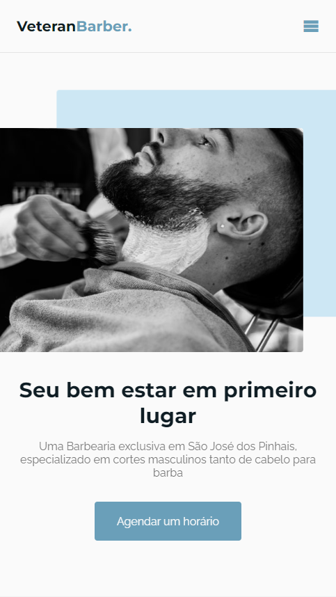

# Veteran Barber.
 

    

 

#
 

 Desenvolvimento foi no modelo Mobile First, foi um desafio diferente tinha a impressão de estar fazendo mais codigo css, mais a aventura foi muito boa, site consiste em você conseguir mudar a cor dele no root com a variavel (hue). 
Já na parte do JavaScript foi criado menus, rolagem do site usando Scroll Reveal uma biblioteca para animações com js. Um button para subir para home.
